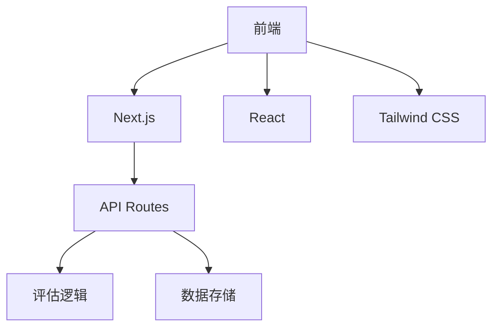

# web-evals 系统概述

## 1. 系统简介
web-evals 是一个基于 Next.js 的评估任务管理系统，主要功能包括：
- 评估任务创建与管理
- 实时运行状态监控
- 运行结果分析与展示

## 2. 技术架构

## 3. 核心功能
### 3.1 评估任务管理
- 支持多种评估类型配置
- 任务队列调度
- 实时状态更新

### 3.2 运行监控
- 实时日志展示
- 运行指标可视化
- 异常检测与告警

### 3.3 数据分析
- 结果对比
- 性能指标统计
- 历史趋势分析

## 4. 使用指南
1. 创建评估任务
2. 监控运行状态
3. 查看分析结果

## 5. 相关文档
- [模块分析](模块分析.md)
- [菜单导航](菜单导航.md)