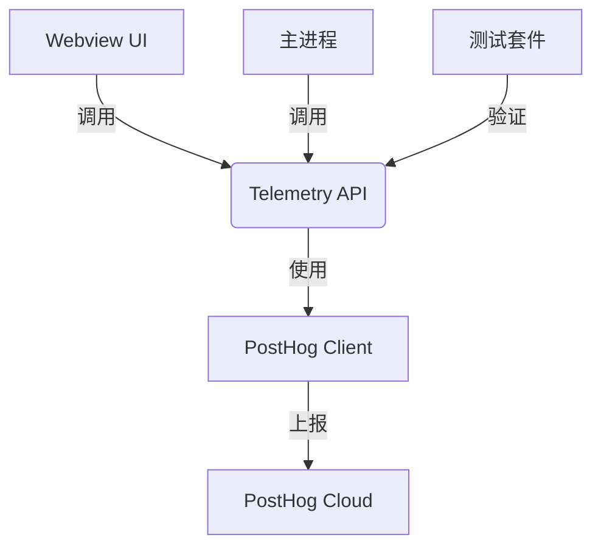

# Telemetry 模块概述

## 功能描述

Telemetry 模块提供用户行为数据收集和分析功能，主要特性包括：

- 统一的事件追踪API
- 多平台集成支持(PostHog等)
- 类型安全的接口设计
- 生产环境优化配置
- 完善的测试覆盖

## 架构图



## 核心组件

1. **Telemetry API** (`index-api`)
   - 提供 `identify`, `track`, `flush` 等核心方法
   - 管理客户端生命周期
   - 处理事件队列和批量上报

2. **PostHog Client** (`posthog-client`)
   - PostHog 平台的具体实现
   - 处理用户标识和事件属性
   - 管理网络请求和错误处理

3. **配置系统**
   - TypeScript 编译配置 (`tsconfig`)
   - 测试框架配置 (`vitest-config`)

## 典型使用场景

1. **用户行为分析**
   ```typescript
   // 追踪按钮点击
   client.track({
     eventName: 'button_click',
     properties: { buttonId: 'submit' }
   })
   ```

2. **功能使用统计**
   ```typescript
   // 记录功能使用
   client.track({
     eventName: 'feature_used',
     properties: { feature: 'code_completion' }
   })
   ```

3. **性能监控**
   ```typescript
   // 记录操作耗时
   const start = Date.now()
   // ...执行操作
   client.track({
     eventName: 'operation_time',
     properties: { duration: Date.now() - start }
   })
   ```

## 配置要求

- Node.js 16+
- TypeScript 4.7+
- PostHog 账号(可选)
- 生产环境HTTPS

## 最佳实践

1. **事件命名**
   - 使用 `snake_case` 命名规范
   - 保持一致性 (如 `view_page`, `click_button`)
   - 避免敏感信息

2. **用户标识**
   ```typescript
   // 正确做法
   client.identify('user123', { plan: 'pro' })

   // 错误做法 (包含敏感信息)
   client.identify('user123', { email: 'user@example.com' })
   ```

3. **生产环境**
   - 启用数据压缩
   - 配置合理的采样率
   - 实现用户同意机制

4. **开发环境**
   - 禁用数据上报
   - 使用Mock客户端
   - 验证事件格式